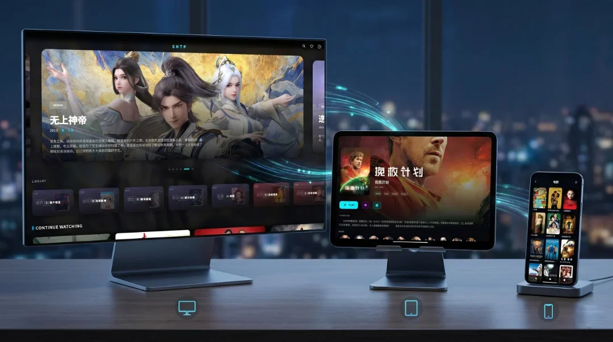

# Optic Player

一款跨平台的 Emby 客户端播放器

---

> 本项目为自用，**暂时只支持 Emby，但该有的功能都有**。  
> 这是 Optic Player 的发布仓库，不含源码，可能会开源（有时间整理的话）。

## 📑 目录

- [⚙️ 播放器内核](#️-播放器内核)
- [📥 安装指南](#-安装指南)
- [⚠️ 注意事项](#️-注意事项)

## ⚙️ 播放器内核

所有平台均集成 `MPV`，部分平台额外支持**原生播放器**（通常具有更好的解码性能）。

| 平台 | 默认内核 | 备用内核 |
| :--- | :--- | :---: |
| **Android / TV** | `Media3 ExoPlayer (+ FFmpeg Extension)` | `MPV` |
| **iOS / iPadOS** | `AVPlayer` | `MPV` |
| **macOS** | `AVPlayer` | `MPV` |
| **Windows** | `MPV` | — |
| **Linux** | `MPV` | — |

## 📥 安装指南

### 🪟 Windows

> 💡 通过 Microsoft Store 安装会自动处理依赖，无需手动安装 VC 运行库。

如果从 GitHub 下载 ZIP 包，需手动安装 VC 运行库最新版：[去微软下载](https://learn.microsoft.com/cpp/windows/latest-supported-vc-redist)。

### 🤖 Android

一个 APK 支持手机、平板和电视（内建 TV 支持）。

### 🍏 macOS

Universal 构建，支持 Intel 和 Apple Silicon。

### 📱 iOS / iPadOS / Apple TV

不签名、不上架 App Store（搞不到美区开发者号）。使用方式自行 Google 或问 AI。

### 🐧 Linux

查看 [Linux 使用文档](./docs/linux-install.md)

## ⚠️ 注意事项

- 在 PC 上，如果需要让播放器走本机的代理软件，请使用 **TUN 模式**。

- 此播放器的 User Agent 为 `OpticPlayer/<version>`。**对于白名单模式 Emby 服，如果没加白，请求会失败（403 响应），导致无法登录和播放。**
